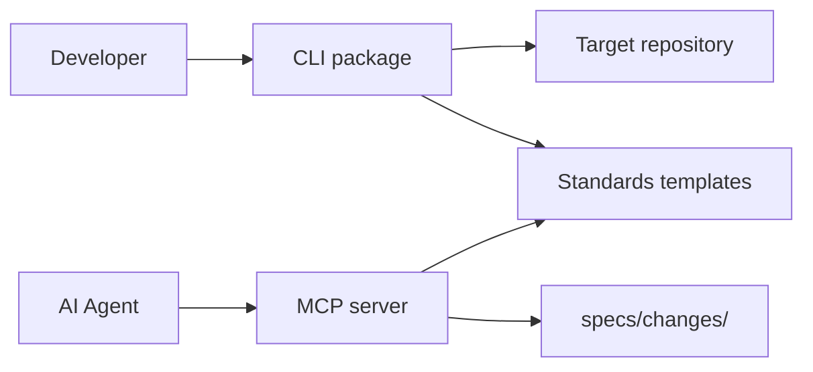

# Architecture Overview

<!-- SpecDriven:managed:start -->

`spec-driven-steroids` is a pnpm monorepo with four workspaces that deliver standards, injection, and validation.

## Workspace Roles

- `packages/cli`: injects templates and MCP config into target repositories.
- `packages/mcp`: exposes validation tools for spec structure and content checks.
- `packages/standards`: stores reusable agent/skill/workflow templates.
- `packages/test-utils`: shared mocks and fixtures for tests.

## System Diagram

## Runtime Flow

1. User runs `spec-driven-steroids inject` in a target repository.
2. CLI copies platform templates and universal skills from `packages/standards`.
3. CLI configures MCP entries for selected platforms.
4. AI tools call MCP validators to enforce EARS, Mermaid, and traceability rules.

## Key Design Decisions

- **Template-first distribution**: standards are plain Markdown assets, easy to version and copy.
- **Validator boundary in MCP**: structural and syntax enforcement lives in `packages/mcp`.
- **Monorepo workspaces**: shared tooling and consistent release workflows across packages.

## Spec-Driven Data Model

The canonical artifact path is:

- `specs/changes/<slug>/requirements.md`
- `specs/changes/<slug>/design.md`
- `specs/changes/<slug>/tasks.md`

Traceability expectation is `REQ-* -> DES-* -> task items`.

See `AGENTS.md` for operational commands and `CONTRIBUTING.md` for development workflow.

<!-- SpecDriven:managed:end -->
