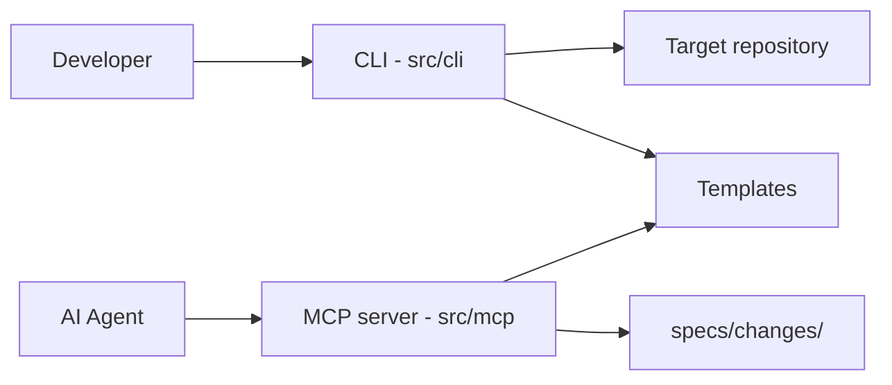

# Architecture Overview

<!-- SpecDriven:managed:start -->

`spec-driven-steroids` is a pnpm monorepo. The core toolkit is published as a single npm package.

## Workspace Roles

- `packages/cli`: the unified package containing CLI, MCP server, and templates.
  - `src/cli/`: injects templates and MCP config into target repositories.
  - `src/mcp/`: exposes validation tools for spec structure and content checks.
  - `templates/`: stores reusable agent/skill/workflow templates.
- `packages/test-utils`: shared mocks and fixtures for tests.
- `packages/landing-page`: standalone Vite app workspace (non-published).

## System Diagram

## Runtime Flow

1. User runs `spec-driven-steroids inject` in a target repository.
2. CLI copies platform templates and universal skills from `templates/`.
3. CLI configures MCP entries for selected platforms.
4. AI tools call MCP validators to enforce EARS, Mermaid, and traceability rules.

## Key Design Decisions

- **Single package distribution**: CLI, MCP server, and templates are co-located for simpler resolution and publishing.
- **Template-first distribution**: standards are plain Markdown assets, easy to version and copy.
- **Validator boundary in MCP**: structural and syntax enforcement lives in `src/mcp/`.
- **Workspace isolation**: test utilities and landing page are separated from published CLI surface.
- **No-install platform support**: JetBrains IDEs (IntelliJ IDEA, PyCharm, WebStorm, Rider, etc.)
  use the same GitHub Copilot Chat interface with `.jetbrains/` folder templates—no plugin installation required.

## Spec-Driven Data Model

The canonical artifact path is:

- `specs/changes/<slug>/requirements.md`
- `specs/changes/<slug>/design.md`
- `specs/changes/<slug>/tasks.md`

Traceability expectation is `REQ-* -> DES-* -> task items`.

See `AGENTS.md` for command/runtime guidance and `CONTRIBUTING.md` for contribution workflow.

<!-- SpecDriven:managed:end -->
