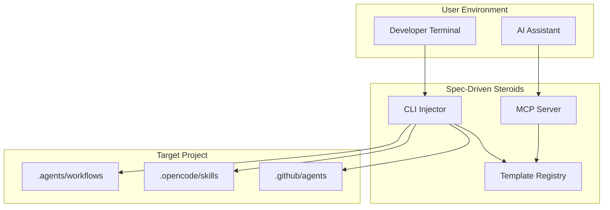
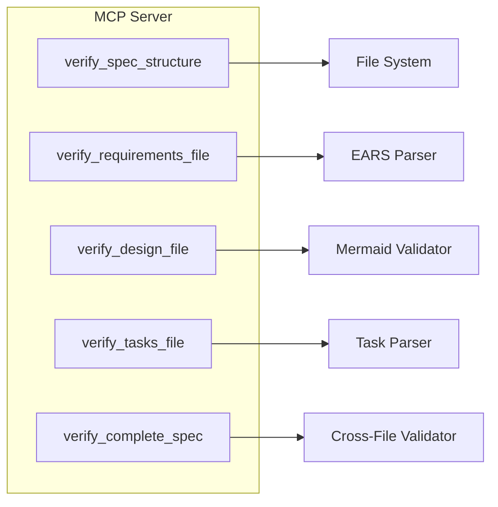
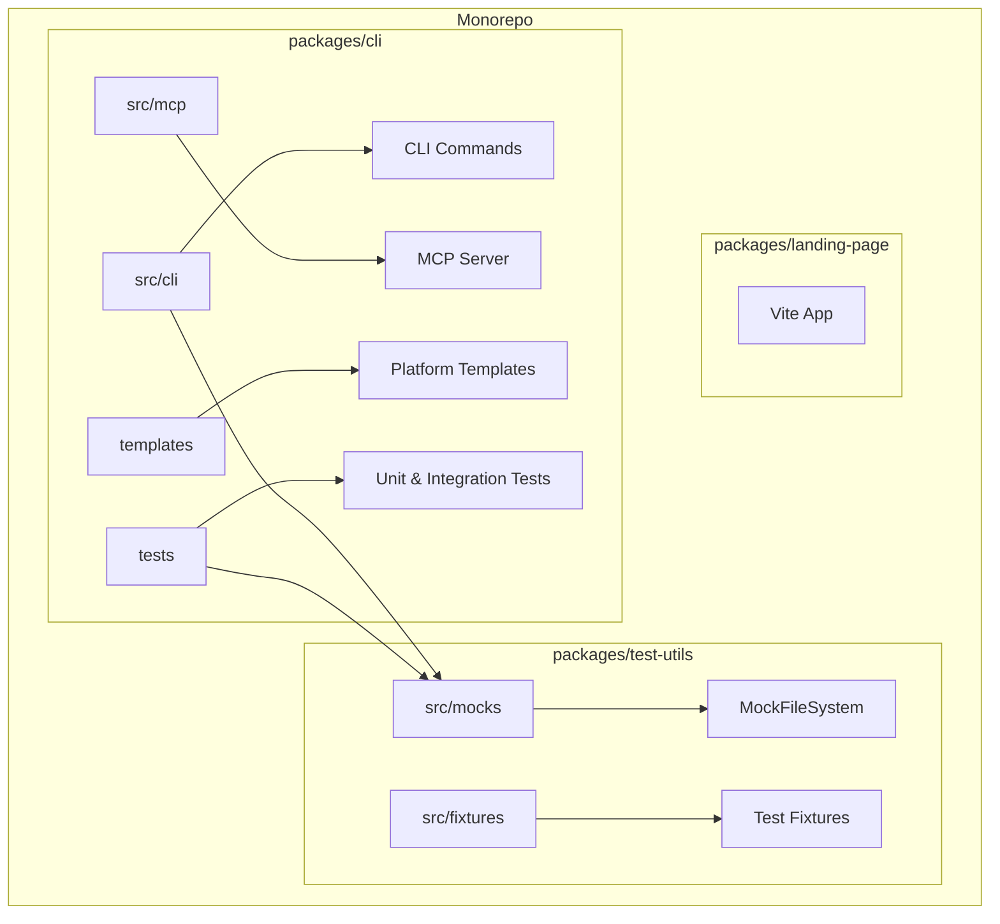
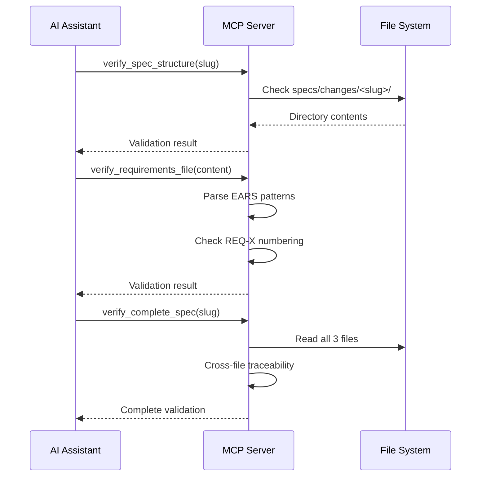
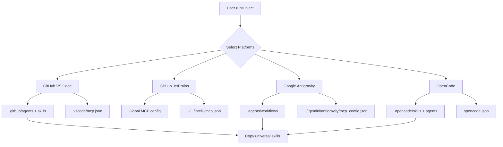
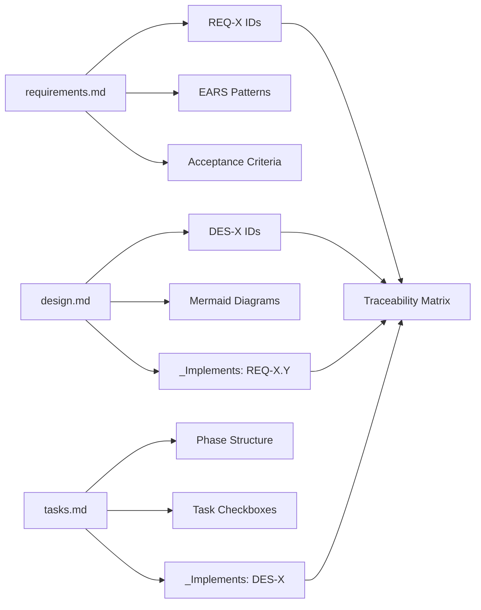

# ARCHITECTURE.md

> System architecture overview for Spec-Driven Steroids.

<!-- SpecDriven:managed:start -->

## System Overview


```mermaid
flowchart TD
    subgraph "User Environment"
        A[Developer Terminal]
        B[AI Assistant]
    end

    subgraph "Spec-Driven Steroids"
        C[CLI Injector]
        D[MCP Server]
        E[Template Registry]
    end

    subgraph "Target Project"
        F[.github/agents]
        G[.opencode/skills]
        H[.agents/workflows]
    end

    A --> C
    B --> D
    C --> E
    C --> F
    C --> G
    C --> H
    D --> E
```

---

## Core Pillars

### 1. The Brain (Standards)

Universal Markdown-based Skills and Agent Profiles that define specialized roles.

**Location**: `packages/cli/templates/universal/skills/`

| Skill | Purpose |
|-------|---------|
| `spec-driven-requirements-writer` | EARS-format requirements documents |
| `spec-driven-technical-designer` | Technical design with Mermaid diagrams |
| `spec-driven-task-decomposer` | Atomic implementation task breakdown |
| `spec-driven-task-implementer` | Feature implementation workflow |
| `project-guidelines-writer` | Project guideline generation |

### 2. The Enforcer (MCP)

A Model Context Protocol server with 5 validation tools.

**Location**: `packages/cli/src/mcp/`


```mermaid
flowchart LR
    subgraph "MCP Server"
        A[verify_spec_structure]
        B[verify_requirements_file]
        C[verify_design_file]
        D[verify_tasks_file]
        E[verify_complete_spec]
    end

    A --> F[File System]
    B --> G[EARS Parser]
    C --> H[Mermaid Validator]
    D --> I[Task Parser]
    E --> J[Cross-File Validator]
```

### 3. The Injector (CLI)

Command-line interface for platform injection and MCP configuration.

**Location**: `packages/cli/src/cli/`

---

## Package Architecture


```mermaid
flowchart TB
    subgraph "Monorepo"
        subgraph "packages/cli"
            A[src/cli] --> B[CLI Commands]
            C[src/mcp] --> D[MCP Server]
            E[templates] --> F[Platform Templates]
            G[tests] --> H[Unit & Integration Tests]
        end

        subgraph "packages/test-utils"
            I[src/mocks] --> J[MockFileSystem]
            K[src/fixtures] --> L[Test Fixtures]
        end

        subgraph "packages/landing-page"
            M[Vite App]
        end
    end

    A --> I
    G --> I
```

---

## Package Responsibilities

| Package | Responsibility |
|---------|---------------|
| `cli` | Main distribution: CLI, MCP Server, Templates |
| `test-utils` | Shared testing utilities and fixtures |
| `landing-page` | Documentation website |

---

## CLI Package Structure

```
packages/cli/
├── src/
│   ├── cli/
│   │   └── index.ts          # CLI entry point, commands
│   └── mcp/
│       ├── index.ts          # MCP server entry, tool handlers
│       └── mermaid-validator.ts  # Mermaid syntax validation
├── templates/
│   ├── github/               # GitHub Copilot templates
│   ├── opencode/             # OpenCode templates
│   ├── antigravity/          # Google Antigravity templates
│   └── universal/            # Platform-agnostic skills
└── tests/
    ├── unit/                 # Unit tests
    └── integration/          # Integration tests
```

---

## MCP Server Architecture


```mermaid
sequenceDiagram
    participant AI as AI Assistant
    participant MCP as MCP Server
    participant FS as File System

    AI->>MCP: verify_spec_structure(slug)
    MCP->>FS: Check specs/changes/<slug>/
    FS-->>MCP: Directory contents
    MCP-->>AI: Validation result

    AI->>MCP: verify_requirements_file(content)
    MCP->>MCP: Parse EARS patterns
    MCP->>MCP: Check REQ-X numbering
    MCP-->>AI: Validation result

    AI->>MCP: verify_complete_spec(slug)
    MCP->>FS: Read all 3 files
    MCP->>MCP: Cross-file traceability
    MCP-->>AI: Complete validation
```

---

## MCP Tool Responsibilities

| Tool | Scope | Validates |
|------|-------|-----------|
| `verify_spec_structure` | File system | Directory exists, required files present |
| `verify_requirements_file` | Content | EARS patterns, REQ-X IDs, acceptance criteria |
| `verify_design_file` | Content | Mermaid diagrams, DES-X IDs, traceability |
| `verify_tasks_file` | Content | Phases, checkboxes, status markers, traceability |
| `verify_complete_spec` | Cross-file | End-to-end traceability REQ → DES → Task |

---

## Platform Injection Flow


```mermaid
flowchart TD
    A[User runs inject] --> B{Select Platforms}
    B --> C[GitHub VS Code]
    B --> D[GitHub JetBrains]
    B --> E[Google Antigravity]
    B --> F[OpenCode]

    C --> G[.github/agents + skills]
    D --> H[Global MCP config]
    E --> I[.agents/workflows]
    F --> J[.opencode/skills + agents]

    G --> K[Copy universal skills]
    I --> K
    J --> K

    C --> L[.vscode/mcp.json]
    D --> M[~/.../intellij/mcp.json]
    E --> N[~/.gemini/antigravity/mcp_config.json]
    F --> O[opencode.json]
```

---

## Data Flow

### Spec Validation Flow


```mermaid
flowchart LR
    A[requirements.md] --> B[REQ-X IDs]
    A --> C[EARS Patterns]
    A --> D[Acceptance Criteria]

    E[design.md] --> F[DES-X IDs]
    E --> G[Mermaid Diagrams]
    E --> H[_Implements: REQ-X.Y]

    I[tasks.md] --> J[Phase Structure]
    I --> K[Task Checkboxes]
    I --> L[_Implements: DES-X]

    B --> M[Traceability Matrix]
    F --> M
    H --> M
    L --> M
```

---

## Configuration Files

| File | Purpose |
|------|---------|
| `package.json` | Package metadata, scripts, dependencies |
| `tsconfig.json` | TypeScript configuration |
| `vitest.config.ts` | Test configuration |
| `opencode.json` | OpenCode MCP configuration |
| `.changeset/config.json` | Changeset configuration |

---

## Extension Points

1. **New Platforms**: Add template directory under `packages/cli/templates/`
2. **New MCP Tools**: Add tool definition and handler in `packages/cli/src/mcp/index.ts`
3. **New Skills**: Add SKILL.md under `packages/cli/templates/universal/skills/`
4. **New Validators**: Add validator module in `packages/cli/src/mcp/`

---

## See Also

- [AGENTS.md](AGENTS.md) - Build commands and agent constraints
- [CONTRIBUTING.md](CONTRIBUTING.md) - Development workflow
- [STYLEGUIDE.md](STYLEGUIDE.md) - Code conventions
- [TESTING.md](TESTING.md) - Testing strategy
- [SECURITY.md](SECURITY.md) - Security considerations

<!-- SpecDriven:managed:end -->