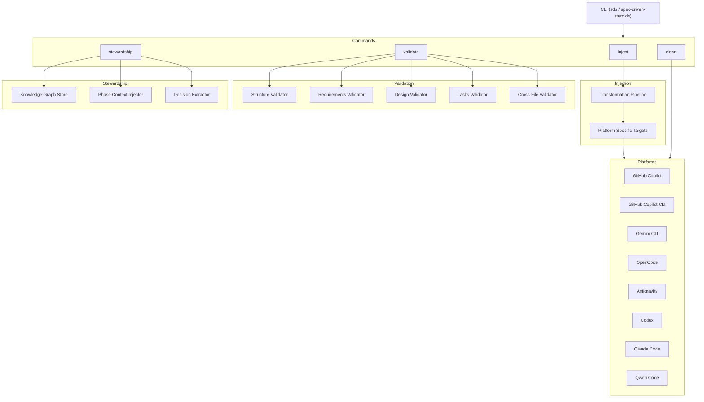
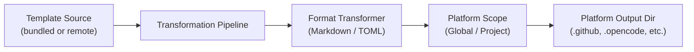
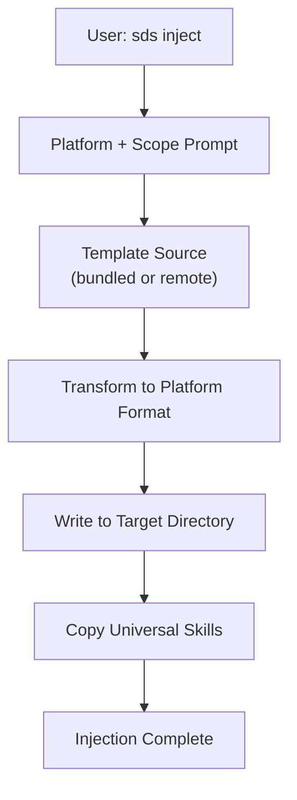

<!-- SpecDriven:managed:start -->

# ARCHITECTURE.md

## High-Level Architecture

Spec-Driven Steroids is a **monorepo CLI tool and template bundle** that injects a Spec-Driven Development workflow into multiple AI coding platforms. It consists of three packages, with the CLI as the single public entry point.


```mermaid
flowchart TB
    CLI["CLI (sds / spec-driven-steroids)"]
    subgraph Commands
        INJECT["inject"]
        VALIDATE["validate"]
        STEWARD["stewardship"]
        CLEAN["clean"]
    end
    subgraph Injection
        TP["Transformation Pipeline"]
        PST["Platform-Specific Targets"]
    end
    subgraph Validation
        VS["Structure Validator"]
        VR["Requirements Validator"]
        VD["Design Validator"]
        VT["Tasks Validator"]
        VX["Cross-File Validator"]
    end
    subgraph Stewardship
        KG["Knowledge Graph Store"]
        PM["Phase Context Injector"]
        EXT["Decision Extractor"]
    end
    subgraph Platforms
        GH["GitHub Copilot"]
        GCLI["GitHub Copilot CLI"]
        GEM["Gemini CLI"]
        OC["OpenCode"]
        AG["Antigravity"]
        CDX["Codex"]
        CC["Claude Code"]
        QC["Qwen Code"]
    end
    CLI --> Commands
    INJECT --> TP --> PST --> Platforms
    VALIDATE --> VS & VR & VD & VT & VX
    STEWARD --> KG & PM & EXT
    CLEAN --> Platforms
```

## Package Boundaries

| Package | Scope | Visibility | Key Responsibility |
|---|---|---|---|
| `packages/cli` | Main CLI + templates | **Public** (published to npm) | CLI commands, template injection, validation, knowledge graph |
| `packages/test-utils` | Shared test utilities | **Private** | Mock filesystem, test fixtures |
| `packages/landing-page` | Documentation site | **Private** | Marketing/landing page (Vite) |

## Component Design

### CLI Entry Point (`packages/cli/src/cli/index.ts`)

The CLI uses `Commander.js` for command routing. Commands are registered as subcommands:
- `sds inject` — Interactive platform selection and template injection
- `sds validate <subcommand>` — Spec validation pipeline
- `sds stewardship <subcommand>` — Knowledge graph management
- `sds clean` — Remove globally injected files

### Platform Injection Pipeline


```mermaid
flowchart LR
    TS["Template Source\n(bundled or remote)"] --> TP["Transformation Pipeline"]
    TP --> FMT["Format Transformer\n(Markdown / TOML)"]
    FMT --> PSC["Platform Scope\n(Global / Project)"]
    PSC --> OUT["Platform Output Dir\n(.github, .opencode, etc.)"]
```

**Key decision**: Platform configs are centralized in `platform-config.ts` as a static registry (`PLATFORM_CONFIGS`). Each platform defines its output format, directory layout, and frontmatter fields. Adding a new platform means adding a new entry to this registry and updating the injection logic in `index.ts`.

### Validation Pipeline

The validation system (`packages/cli/src/core/validate/`) provides progressive, composable validation:

```
sds validate structure   → Verify required files exist
sds validate requirements → Validate EARS syntax and REQ-X numbering
sds validate design      → Validate Mermaid syntax and DES-X traceability
sds validate tasks       → Validate phase structure and _Implements tags
sds validate spec        → Cross-file traceability matrix
```

### Knowledge Graph (Context Stewardship)

The stewardship system (`packages/cli/src/context-stewardship/`) is a file-based JSON knowledge graph for architectural decisions:

| Component | Responsibility |
|---|---|
| `KnowledgeGraphStore` | CRUD operations, conflict detection, version history |
| `ProjectScopedResolver` | Scoped rule resolution with out-of-domain fallback |
| `LifecycleManager` | Rule state transitions (active → deprecated → archived) |
| `SemanticRetrievalEngine` | Token-overlap ranking for retrieval |
| `GracefulDegradationRouter` | Fallback strategy when semantic engine is unavailable |
| `SpecDecisionExtractor` | Extract decision candidates from spec files |
| `PhaseContextInjector` | Inject relevant rules into prompt context per phase |

Rules are stored as JSON files under `~/.agents/stewardship/` with scope isolation (global / orgs / projects).

## Architectural Decisions

### AD-1: Monorepo with Single Public Package

The CLI, test utilities, and landing page share a workspace, but only `packages/cli` is published to npm. This keeps toolchain concerns (test fixtures, marketing site) out of the published artifact.

### AD-2: Template Injection Over Plugin Architecture

Rather than requiring each platform to implement an adapter, the CLI transforms universal templates into platform-specific formats at injection time. This centralizes the workflow logic and reduces per-platform maintenance.

### AD-3: File-Based Knowledge Graph

The stewardship store uses flat JSON files instead of a database. This avoids runtime dependencies and keeps the knowledge graph portable, inspectable, and version-controllable. Write-lock serialization prevents concurrent-write corruption within a single process.

### AD-4: Integration-Test-First Strategy

Full CLI workflows are verified through integration tests that exercise real file systems with mocked user input. Unit tests are reserved for isolated, high-risk logic. See [TESTING.md](TESTING.md) for details.

### AD-5: Remote Template Support with Bundled Fallback

The CLI prefers fetching the latest templates from a remote source but falls back to bundled templates when remote retrieval fails. This enables template updates without new releases while ensuring offline capability.

## Data Flow


```mermaid
flowchart TD
    USER["User: sds inject"] --> PROMPT["Platform + Scope Prompt"]
    PROMPT --> SRC["Template Source\n(bundled or remote)"]
    SRC --> TRANSFORM["Transform to Platform Format"]
    TRANSFORM --> WRITE["Write to Target Directory"]
    WRITE --> SKILLS["Copy Universal Skills"]
    SKILLS --> DONE["Injection Complete"]
```

<!-- SpecDriven:managed:end -->
