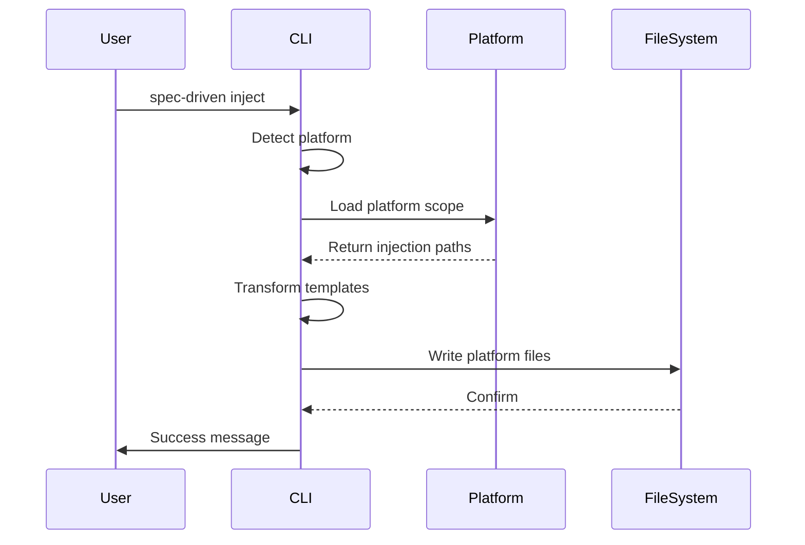
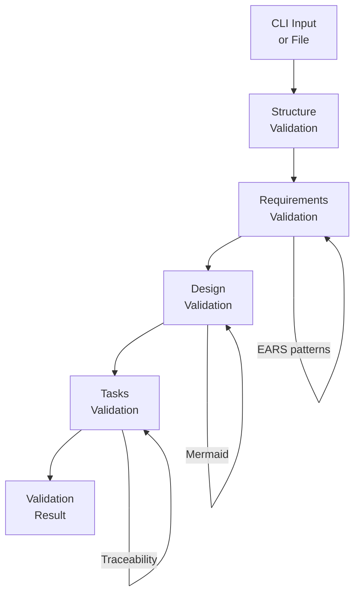
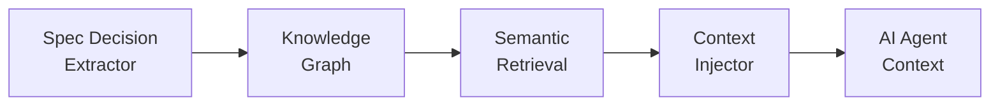

# ARCHITECTURE.md

> High-level architecture, system boundaries, and design decisions for Spec-Driven Steroids.

<!-- SpecDriven:managed:start -->

## System Overview

Spec-Driven Steroids injects a structured spec-driven workflow (requirements → design → tasks → implementation) into AI coding platforms without requiring a new UI.

## Package Architecture

```mermaid
graph TB
    subgraph "packages/cli"
        CLI[CLI Entry<br/>(index.ts)]
        TRANSFORM[Transformation<br/>Pipeline]
        VALIDATE[Validation Modules]
        KNOWLEDGE[Knowledge Graph<br/>System]

        CLI -->|injects| PLATFORMS[Platform Scopes]
        CLI -->|validates| VALIDATE
        CLI -->|manages| KNOWLEDGE
    end

    subgraph "packages/test-utils"
        MOCKS[MockFileSystem]
        FIXTURES[Fixtures]
    end

    subgraph "packages/landing-page"
        DOCS[Documentation Site]
    end

    VALIDATE -.->|uses| MOCKS
    KNOWLEDGE -.->|stores| MOCKS
```

## Core Packages

### packages/cli

Main CLI package providing injection and validation.

| Module | Responsibility |
|--------|---------------|
| `src/cli/` | CLI entry points, platform injection |
| `src/core/validate/` | Requirements, design, tasks, structure validation |
| `src/context-stewardship/` | Knowledge graph and semantic retrieval |
| `templates/` | Platform-specific agents, commands, skills |

### packages/test-utils

Shared testing utilities.

| Module | Responsibility |
|--------|---------------|
| `src/mocks/mock-fs.ts` | Mock file system for tests |
| `src/fixtures/` | Test fixtures for validation |

### packages/landing-page

Documentation site built with Vite/Svelte.

## Injection Architecture

### Platform Injection Flow


```mermaid
sequenceDiagram
    User->>CLI: spec-driven inject
    CLI->>CLI: Detect platform
    CLI->>Platform: Load platform scope
    Platform-->>CLI: Return injection paths
    CLI->>CLI: Transform templates
    CLI->>FileSystem: Write platform files
    FileSystem-->>CLI: Confirm
    CLI->>User: Success message
```

### Supported Platforms

| Platform | Scope Type | Injection Target |
|----------|-----------|------------------|
| Antigravity | project | `/spec-driven` agent |
| Claude Code | project | `CLAUDE.md` |
| Gemini CLI | global | MCP servers, agents, commands |
| GitHub Copilot CLI | global | MCP servers, skills |
| GitHub Copilot VS Code | global | MCP config |
| GitHub Copilot JetBrains | global | MCP config |
| OpenCode | global | MCP config, skills |
| OpenAI Codex | project | Agent instructions |
| Qwen Code | global | MCP config, skills |

## Validation Architecture

### Validation Layers


```mermaid
graph TD
    INPUT[CLI Input<br/>or File] --> STRUCTURE[Structure<br/>Validation]

    STRUCTURE --> REQ[Requirements<br/>Validation]

    REQ --> DESIGN[Design<br/>Validation]

    DESIGN --> TASKS[Tasks<br/>Validation]

    TASKS --> RESULT[Validation<br/>Result]

    REQ -->|EARS patterns| REQ
    DESIGN -->|Mermaid| DESIGN
    TASKS -->|Traceability| TASKS
```

### Validation Modules

| Module | Validates |
|--------|-----------|
| `structure.ts` | Spec folder structure, required files |
| `requirements.ts` | EARS syntax, REQ-ID format |
| `design.ts` | Mermaid diagrams, architecture sections |
| `tasks.ts` | Task structure, traceability links |
| `spec.ts` | Full spec end-to-end |

## Context Stewardship

Knowledge graph system for persisting architectural decisions.


```mermaid
graph LR
    EXTRACT[Spec Decision<br/>Extractor] --> GRAPH[Knowledge<br/>Graph]
    GRAPH --> RETRIEVE[Semantic<br/>Retrieval]
    RETRIEVE --> INJECT[Context<br/>Injector]
    INJECT --> AGENT[AI Agent<br/>Context]
```

### Components

| Component | Responsibility |
|-----------|---------------|
| `knowledge-graph-store.ts` | JSON graph persistence |
| `semantic-retrieval-engine.ts` | Semantic search |
| `spec-decision-extractor.ts` | Extract decisions from specs |
| `orchestrator.ts` | Coordinate components |
| `domain-taxonomy.ts` | Categorize decisions |

## Design Decisions

### Technology Choices

| Decision | Rationale |
|----------|-----------|
| TypeScript ESM | Modern Node.js support, tree-shaking |
| Commander for CLI | Simple CLI framework, subcommands |
| Vitest for testing | Fast, near Jest compatibility |
| fs-extra | Promise-based file operations |
| Changesets | Semantic versioning, changelog auto-generation |

### Module Resolution

Uses `.js` extension for runtime compatibility:

```typescript
// Source (.ts)
import { validateRequirements } from './requirements.js';

// Bundler resolves .ts → .js at build time
```

### Error Handling Strategy

- Typed validation errors with context
- Suggested fixes in error messages
- Skill documentation links
- Exit codes for CLI integration

## File Structure

```
packages/cli/
├── src/
│   ├── cli/
│   │   ├── index.ts           # Main CLI entry
│   │   ├── transformation-pipeline.ts
│   │   ├── format-transformer.ts
│   │   ├── template-source.ts
│   │   └── platform-scopes/
│   │       ├── antigravity-scope.ts
│   │       ├── opencode-scope.ts
│   │       ├── github-copilot-scope.ts
│   │       ├── github-copilot-cli-scope.ts
│   │       ├── gemini-cli-scope.ts
│   │       └── qwen-code-scope.ts
│   ├── core/
│   │   └── validate/
│   │       ├── index.ts
│   │       ├── structure.ts
│   │       ├── requirements.ts
│   │       ├── design.ts
│   │       ├── tasks.ts
│   │       ├── spec.ts
│   │       └── shared/
│   │           ├── formatter.ts
│   │           ├── traceability.ts
│   │           ├── ids.ts
│   │           ├── ears.ts
│   │           └── mermaid.ts
│   └── context-stewardship/
│       ├── orchestrator.ts
│       ├── knowledge-graph-store.ts
│       ├── semantic-retrieval-engine.ts
│       ├── spec-decision-extractor.ts
│       ├── domain-taxonomy.ts
│       ├── graceful-degradation-router.ts
│       └── lifecycle-manager.ts
├── templates/
│   └── universal/
│       ├── agents/
│       ├── commands/
│       └── skills/
└── tests/
    ├── unit/
    └── integration/
```

<!-- SpecDriven:managed:end -->

## See Also

- [AGENTS.md](AGENTS.md) - Project structure and build commands
- [CONTRIBUTING.md](CONTRIBUTING.md) - Developer workflow
- [TESTING.md](TESTING.md) - Testing patterns