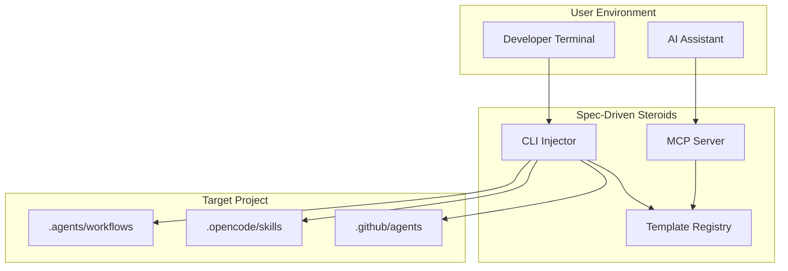
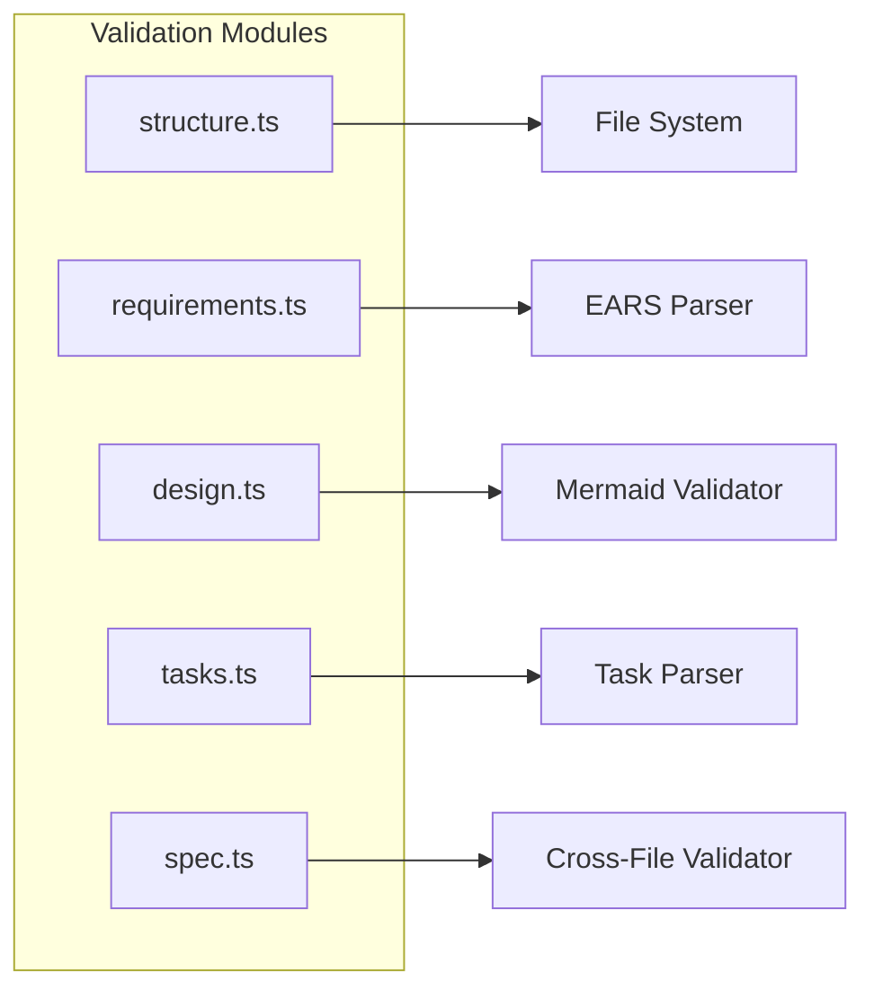
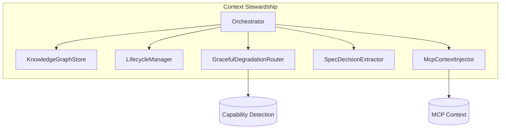
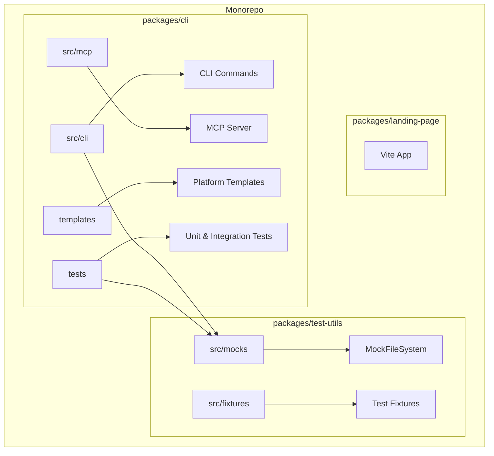
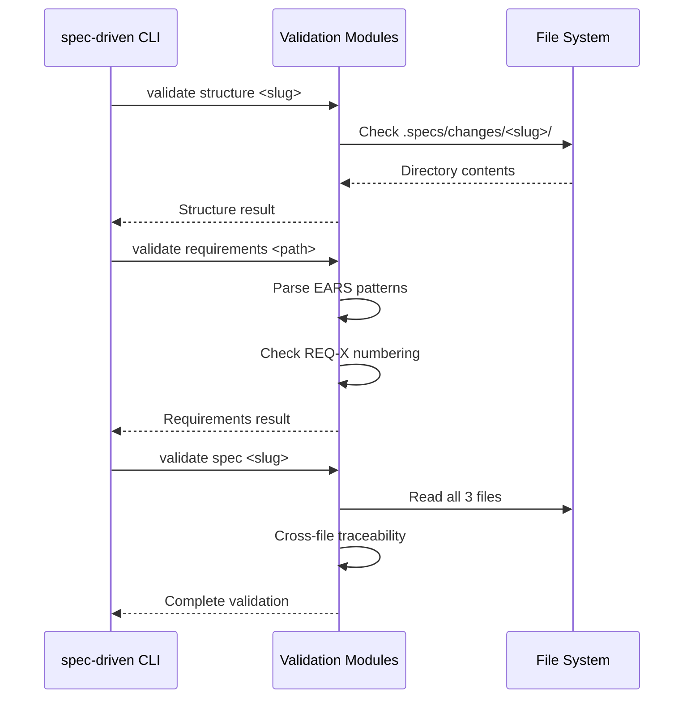
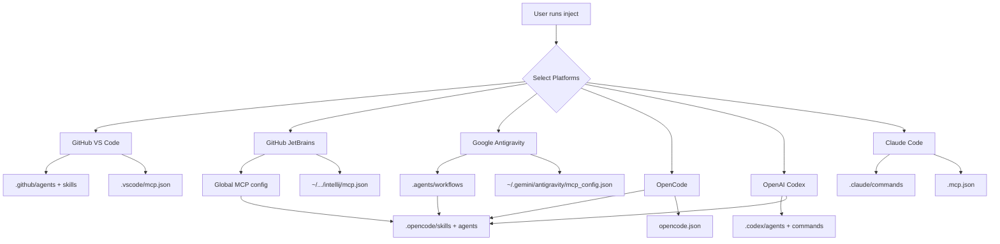
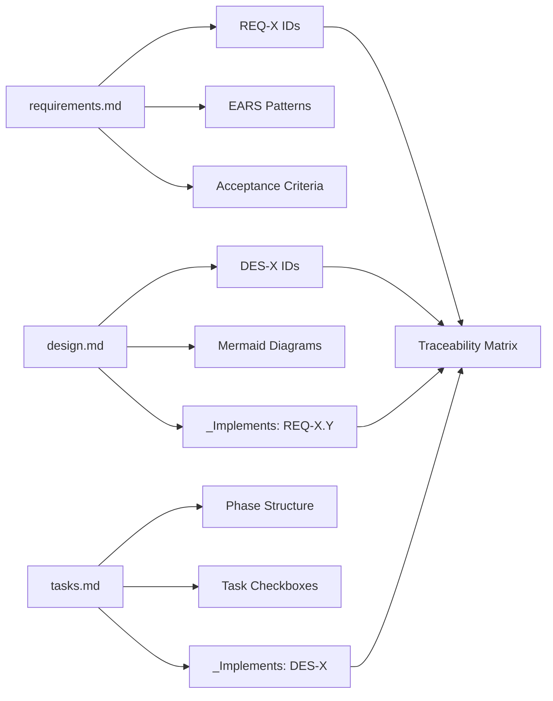
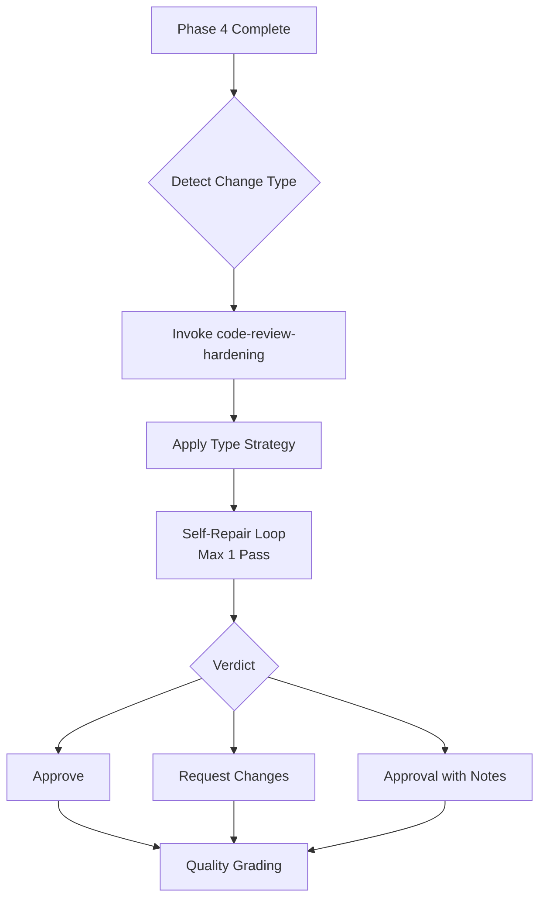

# ARCHITECTURE.md

> System architecture overview for Spec-Driven Steroids.

<!-- SpecDriven:managed:start -->

## System Overview


```mermaid
flowchart TD
    subgraph "User Environment"
        A[Developer Terminal]
        B[AI Assistant]
    end

    subgraph "Spec-Driven Steroids"
        C[CLI Injector]
        D[MCP Server]
        E[Template Registry]
    end

    subgraph "Target Project"
        F[.github/agents]
        G[.opencode/skills]
        H[.agents/workflows]
    end

    A --> C
    B --> D
    C --> E
    C --> F
    C --> G
    C --> H
    D --> E
```

---

## Core Pillars

### 1. The Brain (Standards)

Universal Markdown-based Skills and Agent Profiles that define specialized roles.

**Location**: `packages/cli/templates/universal/skills/`

| Skill | Purpose |
|-------|---------|
| `spec-driven-requirements-writer` | EARS-format requirements documents |
| `spec-driven-technical-designer` | Technical design with Mermaid diagrams |
| `spec-driven-task-decomposer` | Atomic implementation task breakdown |
| `spec-driven-task-implementer` | Feature implementation workflow (includes Phase 5 code review) |
| `code-review-hardening` | Rigorous, type-aware code review with self-repair loop |
| `contextual-stewardship` | Architectural decisions and business rules memory |
| `quality-grading` | Grades code/specs 1-5 across 4 dimensions with auto-fix |
| `long-running-work-planning` | Multi-step reasoning for complex problems |
| `project-guidelines-writer` | Project guideline generation |

### 2. The Enforcer (Validation)

TypeScript validation modules with CLI commands for spec validation.

**Location**: `packages/cli/src/core/validate/`


```mermaid
flowchart LR
    subgraph "Validation Modules"
        A[structure.ts]
        B[requirements.ts]
        C[design.ts]
        D[tasks.ts]
        E[spec.ts]
    end

    A --> F[File System]
    B --> G[EARS Parser]
    C --> H[Mermaid Validator]
    D --> I[Task Parser]
    E --> J[Cross-File Validator]
```

### 3. The Injector (CLI)

Command-line interface for platform injection and MCP configuration.

**Location**: `packages/cli/src/cli/`

### 4. The Memory (Context Stewardship)

Knowledge graph system for persistent architectural memory and graceful degradation.

**Location**: `packages/cli/src/context-stewardship/`


```mermaid
flowchart TD
    subgraph "Context Stewardship"
        A[Orchestrator]
        B[KnowledgeGraphStore]
        C[LifecycleManager]
        D[GracefulDegradationRouter]
        E[SpecDecisionExtractor]
        F[McpContextInjector]
    end

    A --> B
    A --> C
    A --> D
    A --> E
    A --> F
    D --> G[(Capability Detection)]
    F --> H[(MCP Context)]
```

---

## Package Architecture


```mermaid
flowchart TB
    subgraph "Monorepo"
        subgraph "packages/cli"
            A[src/cli] --> B[CLI Commands]
            C[src/mcp] --> D[MCP Server]
            E[templates] --> F[Platform Templates]
            G[tests] --> H[Unit & Integration Tests]
        end

        subgraph "packages/test-utils"
            I[src/mocks] --> J[MockFileSystem]
            K[src/fixtures] --> L[Test Fixtures]
        end

        subgraph "packages/landing-page"
            M[Vite App]
        end
    end

    A --> I
    G --> I
```

---

## Package Responsibilities

| Package | Responsibility |
|---------|---------------|
| `cli` | Main distribution: CLI, MCP Server, Templates |
| `test-utils` | Shared testing utilities and fixtures |
| `landing-page` | Documentation website |

---

## CLI Package Structure

```
packages/cli/
├── src/
│   ├── cli/                  # Terminal interface and injection
│   │   ├── index.ts         # CLI entry point, commands
│   │   ├── platform-config.ts
│   │   ├── template-source.ts
│   │   ├── transformation-pipeline.ts
│   │   ├── format-transformer.ts
│   │   └── opencode-scope.ts
│   ├── core/validate/       # Validation modules
│   │   ├── index.ts         # validate command factory
│   │   ├── requirements.ts  # EARS validation
│   │   ├── design.ts        # Mermaid validation
│   │   ├── tasks.ts        # Task phase validation
│   │   ├── structure.ts    # File structure validation
│   │   ├── spec.ts         # Cross-file validation
│   │   └── shared/         # Shared utilities
│   └── context-stewardship/ # Knowledge graph system
│       ├── orchestrator.ts
│       ├── knowledge-graph-store.ts
│       ├── lifecycle-manager.ts
│       ├── graceful-degradation-router.ts
│       └── types.ts
├── templates/
│   ├── github/               # GitHub Copilot templates
│   ├── opencode/             # OpenCode templates
│   ├── antigravity/          # Google Antigravity templates
│   ├── codex/                # OpenAI Codex templates
│   ├── claudecode/           # Claude Code templates
│   └── universal/            # Platform-agnostic skills
└── tests/
    ├── unit/                 # Unit tests
    └── integration/          # Integration tests
```

---

## Validation Architecture


```mermaid
sequenceDiagram
    participant CLI as spec-driven CLI
    participant Val as Validation Modules
    participant FS as File System

    CLI->>Val: validate structure <slug>
    Val->>FS: Check .specs/changes/<slug>/
    FS-->>Val: Directory contents
    Val-->>CLI: Structure result

    CLI->>Val: validate requirements <path>
    Val->>Val: Parse EARS patterns
    Val->>Val: Check REQ-X numbering
    Val-->>CLI: Requirements result

    CLI->>Val: validate spec <slug>
    Val->>FS: Read all 3 files
    Val->>Val: Cross-file traceability
    Val-->>CLI: Complete validation
```

---

## Validation Module Responsibilities

| Module | Scope | Validates |
|--------|-------|-----------|
| `structure.ts` | File system | Directory exists, required files present |
| `requirements.ts` | Content | EARS patterns, REQ-X IDs, acceptance criteria |
| `design.ts` | Content | Mermaid diagrams, DES-X IDs, traceability |
| `tasks.ts` | Content | Phases, checkboxes, status markers, traceability |
| `spec.ts` | Cross-file | End-to-end traceability REQ → DES → Task |

---

## Platform Injection Flow


```mermaid
flowchart TD
    A[User runs inject] --> B{Select Platforms}
    B --> C[GitHub VS Code]
    B --> D[GitHub JetBrains]
    B --> E[Google Antigravity]
    B --> F[OpenCode]
    B --> G[OpenAI Codex]
    B --> H[Claude Code]

    C --> I[.github/agents + skills]
    D --> J[Global MCP config]
    E --> K[.agents/workflows]
    F --> L[.opencode/skills + agents]
    G --> M[.codex/agents + commands]
    H --> N[.claude/commands]

    G --> L
    J --> L
    K --> L

    C --> O[.vscode/mcp.json]
    D --> P[~/.../intellij/mcp.json]
    E --> Q[~/.gemini/antigravity/mcp_config.json]
    F --> R[opencode.json]
    H --> S[.mcp.json]
```

---

## Data Flow

### Spec Validation Flow


```mermaid
flowchart LR
    A[requirements.md] --> B[REQ-X IDs]
    A --> C[EARS Patterns]
    A --> D[Acceptance Criteria]

    E[design.md] --> F[DES-X IDs]
    E --> G[Mermaid Diagrams]
    E --> H[_Implements: REQ-X.Y]

    I[tasks.md] --> J[Phase Structure]
    I --> K[Task Checkboxes]
    I --> L[_Implements: DES-X]

    B --> M[Traceability Matrix]
    F --> M
    H --> M
    L --> M
```

---

## Configuration Files

| File | Purpose |
|------|---------|
| `package.json` | Package metadata, scripts, dependencies |
| `tsconfig.json` | TypeScript configuration |
| `vitest.config.ts` | Test configuration |
| `opencode.json` | OpenCode MCP configuration |
| `.changeset/config.json` | Changeset configuration |

---

## Phase 5: Code Review Flow

After all Phase 4 implementation tasks complete, the spec-driven-task-implementer automatically triggers code review:


```mermaid
flowchart TD
    A[Phase 4 Complete] --> B{Detect Change Type}
    B --> C[Invoke code-review-hardening]
    C --> D[Apply Type Strategy]
    D --> E[Self-Repair Loop<br/>Max 1 Pass]
    E --> F{Verdict}
    F --> G[Approve]
    F --> H[Request Changes]
    F --> I[Approval with Notes]
    G --> J[Quality Grading]
    H --> J
    I --> J
```

**Change Type Detection (in priority order):**
1. Explicit tag from task context
2. Branch name scan (feat/, fix/, hotfix/, refactor/, chore/, docs/)
3. Commit message scan
4. Heuristic guess
5. Fallback: General review

**Review Outcomes:**
- `Approve` — All blocking findings resolved, proceed to quality grading
- `Request Changes` — Author-required blocking findings, note and proceed to quality grading
- `Approval with Notes` — Scoped review complete, other areas need other reviewers

---

## Context Stewardship System

The Context Stewardship system provides persistent memory for architectural decisions and business rules.

### Storage Backend

The system uses a JSON file-based knowledge graph storage:

| Backend | Storage Location |
|---------|-----------------|
| `json-graph` | `~/.agents/stewardship/{scope}/{state}/` JSON files |

Features: semantic retrieval, versioning, conflict detection, lifecycle management.

### Knowledge Graph

Rules are stored with full provenance and lifecycle tracking:

```typescript
interface RuleNode {
    id: string
    domain: Domain
    subDomain?: string
    content: string
    provenance: {
        source: 'manual' | 'extract' | 'import'
        author: string
        decisionDate: string  // ISO-8601
        originalText: string
    }
    metadata: {
        confidence: number  // 0-1
        expiresAt: string  // ISO-8601
        tags: string[]
    }
    state: {
        value: 'active' | 'deprecated' | 'archived'
        changedAt: string
        changedBy: string
    }
    relations: string[]  // rule IDs
}
```

### Standard Domains

| Domain | Purpose |
|--------|---------|
| `architecture` | System design, patterns, decisions |
| `business` | Business rules, domain logic |
| `workflow` | Process definitions, phases |
| `security` | Security policies, authentication |
| `performance` | Optimization rules, SLAs |
| `legal` | Compliance, data handling |
| `team-structure` | Org charts, responsibilities |
| `technical-debt` | Debt tracking, remediation |

---

## Extension Points

1. **New Platforms**: Add template directory under `packages/cli/templates/`
2. **New Validators**: Add validator module in `packages/cli/src/core/validate/`
3. **New Skills**: Add SKILL.md under `packages/cli/templates/universal/skills/`
4. **New Context Domains**: Add to `Domain` type in `context-stewardship/types.ts`

---

## See Also

- [AGENTS.md](AGENTS.md) - Build commands and agent constraints
- [CONTRIBUTING.md](CONTRIBUTING.md) - Development workflow
- [STYLEGUIDE.md](STYLEGUIDE.md) - Code conventions
- [TESTING.md](TESTING.md) - Testing strategy
- [SECURITY.md](SECURITY.md) - Security considerations

<!-- SpecDriven:managed:end -->