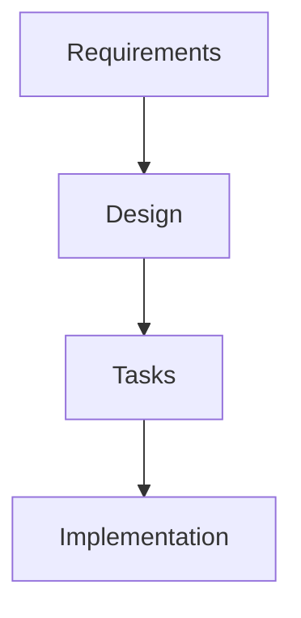

# STYLEGUIDE.md

> Code conventions, naming patterns, and style guidelines for Spec-Driven Steroids.

<!-- SpecDriven:managed:start -->

## TypeScript Conventions

### File Naming

| Type | Pattern | Example |
|------|---------|---------|
| Source | `kebab-case.ts` | `validation-result.ts` |
| Test | `kebab-case.test.ts` | `validation-result.test.ts` |
| Type | `kebab-case.ts` | `types.ts` |

### Naming Conventions

| Element | Convention | Example |
|---------|------------|---------|
| Variables | camelCase | `validationResult` |
| Constants | UPPER_SNAKE_CASE | `MAX_RETRY_COUNT` |
| Functions | camelCase | `validateRequirements` |
| Classes | PascalCase | `ValidationError` |
| Interfaces | PascalCase | `ValidationResult` |
| Types | PascalCase | `ValidationError` |
| Enums | PascalCase | `UnifiedScope` |
| Enum Values | UPPER_SNAKE_CASE | `PROJECT = 'project'` |
| Files | kebab-case | `validation-result.ts` |

### Import Order

1. Node built-ins (`path`, `fs`, `url`)
2. External packages (`commander`, `chalk`, `inquirer`)
3. Internal packages (`@spec-driven-steroids/...`)
4. Relative imports (`../`, `./`)

```typescript
import path from 'path';
import { Command } from 'commander';
import chalk from 'chalk';
import { ValidationError } from '../../core/validate/shared/formatter.js';
import { resolveTemplateSource } from './template-source.js';
```

### Export Patterns

- Use named exports for utilities and functions
- Use default exports for single-purpose modules only
- Re-export from index barrels

```typescript
// Named exports
export function validateRequirements(content: string): ValidationResult {
  // ...
}

// Barrel re-export
export * from './formatter.js';
export { validateRequirements, validateDesign } from './requirements.js';
```

### Module Resolution

Use `.js` extension for runtime imports, not `.ts`:

```typescript
// Correct
import { validateRequirements } from './requirements.js';

// Avoid (unless testing)
import { validateRequirements } from './requirements';
```

## Code Style

### TypeScript Configuration

```json
{
  "compilerOptions": {
    "target": "ES2022",
    "module": "ESNext",
    "moduleResolution": "bundler",
    "strict": true,
    "esModuleInterop": true,
    "skipLibCheck": true,
    "forceConsistentCasingInFileNames": true,
    "declaration": true,
    "declarationMap": true,
    "sourceMap": true
  }
}
```

### Async/Await

Prefer async/await over promise chaining:

```typescript
// Preferred
async function processValidation(spec: string): Promise<ValidationResult> {
  const content = await fs.readFile(spec, 'utf-8');
  return validateRequirements(content);
}

// Avoid
function processValidation(spec: string): Promise<ValidationResult> {
  return fs.readFile(spec, 'utf-8').then(content => {
    return validateRequirements(content);
  });
}
```

### Error Handling

Use typed errors with context:

```typescript
interface ValidationError {
  errorType: string;
  context?: string;
  message: string;
  suggestedFix?: string;
  skillDocLink?: string;
}
```

### Type Annotations

Use explicit return types for exported functions:

```typescript
export function formatError(error: ValidationError): string {
  return `[${error.errorType}] → ${error.message}`;
}
```

### Interface vs Type

Use interfaces for object shapes, types for unions and intersections:

```typescript
// Interface for object shape
interface ValidationResult {
  valid: boolean;
  errors: ValidationError[];
  warnings?: ValidationWarning[];
}

// Type for union
type ValidationScope = 'project' | 'global';
```

## CLI Command Patterns

### Commander Setup

```typescript
const program = new Command();

program
  .name('spec-driven')
  .description('Inject spec-driven workflow into AI agents')
  .version(packageJson.version);

program
  .command('inject')
  .description('Inject platform-specific files')
  .option('-s, --scope <scope>', 'Injection scope', 'project')
  .action(injectCommand);

program.parse(process.argv);
```

### Exit Codes

Use exit codes for CLI commands:

| Code | Meaning |
|------|---------|
| 0 | Success |
| 1 | Validation errors found |
| 2 | Invalid arguments |
| 3 | File system error |

```typescript
import { getExitCode } from './core/validate/shared/formatter.js';

process.exit(getExitCode(result));
```

## Markdown Conventions

### EARS Requirements

```markdown
### Requirement REQ-1: Feature Description

1. THE system SHALL perform action. _(Ubiquitous language)_
2. WHEN condition, THE system SHALL respond. _(Event-driven)_
```

### Mermaid Diagrams

Use `mermaid` code blocks:



## File Organization

```
packages/cli/src/
├── cli/                    # CLI entry points
│   ├── index.ts           # Main CLI
│   ├── transformation-pipeline.ts
│   └── platform-scopes/  # Platform-specific injection
├── core/
│   └── validate/         # Validation modules
│       ├── requirements.ts
│       ├── design.ts
│       ├── tasks.ts
│       └── shared/       # Shared utilities
└── context-stewardship/  # Knowledge graph system
```

<!-- SpecDriven:managed:end -->

## See Also

- [AGENTS.md](AGENTS.md) - Agent constraints and project structure
- [TESTING.md](TESTING.md) - Testing patterns
- [ARCHITECTURE.md](ARCHITECTURE.md) - System architecture