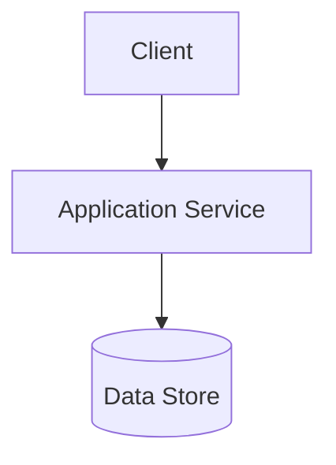
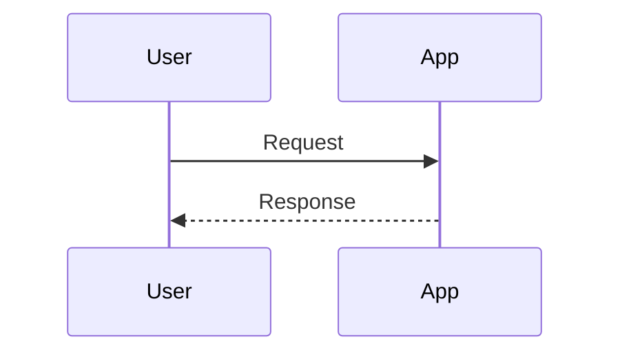
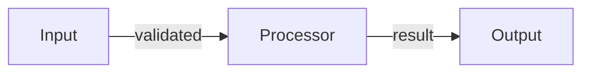
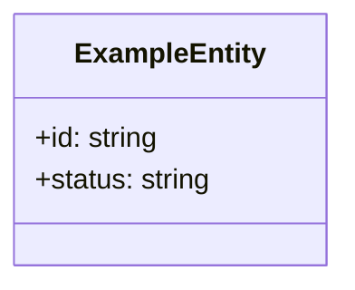

# Document Templates

This file contains the required document templates for the Spec-Driven workflow. These templates are referenced by the phase skills and must remain identical to the original inline versions.

## Requirements Document Template

```markdown
# Requirements

## Overview
<1-3 short paragraphs describing the problem, user value, and scope>

## Glossary
| Term | Definition |
|------|------------|
| <Term> | <Clear, unambiguous definition> |

## Assumptions
- <assumption 1>
- <assumption 2>

## Requirements

### REQ-1: <short requirement title>

**User Story:** As a <role>, I want <capability>, so that <benefit>.

#### Acceptance Criteria
1.1 WHEN <trigger>, THEN the <system name> SHALL <response>.
1.2 IF <undesired condition>, THEN the <system name> SHALL <response>.

### REQ-2: <short requirement title>

**User Story:** As a <role>, I want <capability>, so that <benefit>.

#### Acceptance Criteria
2.1 THE <system name> SHALL <response>.
2.2 WHILE <precondition>, the <system name> SHALL <response>.
```

## Design Document Template

```markdown
# Design Document

## Overview

<1-3 short paragraphs describing the technical approach, boundaries, and important constraints>

### Change Type

<new-feature | enhancement | refactoring | bug-fix | performance | infrastructure | documentation>

### Design Goals

1. <goal one>
2. <goal two>

### References

- **REQ-1**: <requirement title>
- **REQ-2**: <requirement title>

## System Architecture

### DES-1: <design element title>

<1-2 short paragraphs describing responsibility, boundaries, and behavior>



_Implements: REQ-1.1, REQ-1.2_

### DES-2: <design element title>

<short description>



_Implements: REQ-2.1_

## Data Flow

_Include only when the change transforms data across multiple steps, services, or boundaries._



## Code Anatomy

| File Path | Status | Evidence | Purpose | Implements |
|-----------|--------|----------|---------|------------|
| src/example/service.ts | Existing | Verified by Glob/Read | Core orchestration for the feature | DES-1 |
| src/example/handler.ts | New | Proposed by DES-2 | Entry point for the request flow | DES-2 |

## Repository Context Evidence

| Source | Evidence | Applied Constraint |
|--------|----------|--------------------|
| AGENTS.md | Read before design | Follow repository agent constraints and validation commands |
| ARCHITECTURE.md | Read before design | Preserve documented package boundaries |
| src/example/service.ts | Verified by Glob/Read | Reuse existing service naming and module placement |
| contextual-stewardship:architecture | Retrieved before design | Apply active architecture rules |

## Data Models

_Include only when the change introduces or modifies data structures._



## Error Handling

_Include only when the change introduces or changes failure behavior._

| Error Condition | Response | Recovery |
|-----------------|----------|----------|
| Invalid input | Reject request | Return validation message |
| Dependency failure | Surface service error | Retry or fail safely |

## Impact Analysis

_Include only when modifying existing features, shared code, contracts, or operational behavior._

| Affected Area | Impact Level | Notes |
|---------------|--------------|-------|
| src/example/api.ts | High | Shared request contract changes |
| src/example/store.ts | Medium | Persistence logic update |

### Breaking Changes

| Change | Description | Mitigation |
|--------|-------------|------------|
| API contract | Response shape changes | Preserve compatibility layer |

### Dependencies

| Dependency | Type | Impact |
|------------|------|--------|
| External API | Runtime | Requires updated request mapping |

### Risk Assessment

| Risk | Likelihood | Impact | Mitigation |
|------|------------|--------|------------|
| Invalid migration | Medium | High | Validate data before rollout |

### Testing Requirements

| Test Type | Coverage Goal | Notes |
|-----------|---------------|-------|
| Integration | Critical flow | Verify service boundary behavior |
| E2E | User-visible path | Confirm end-to-end success and failure cases |

### Rollback Plan

| Scenario | Rollback Steps | Time to Recovery |
|----------|----------------|------------------|
| Deployment issue | Revert release and restore config | < 15 minutes |

## Traceability Matrix

| Design Element | Requirements |
|----------------|--------------|
| DES-1 | REQ-1.1, REQ-1.2 |
| DES-2 | REQ-2.1 |
```

## Tasks Document Template

```markdown
# Implementation Tasks

## Overview

This implementation is organized into 4 phases:

1. **Foundation** - Prepare core structures and entry points
2. **Feature Delivery** - Implement the main design elements
3. **Acceptance Criteria Testing** - Verify requirement behavior
4. **Final Checkpoint** - Validate completeness and readiness

**Estimated Effort**: Medium (3-5 sessions)

## Repository Constraints

- Follow `TESTING.md` for test placement and command selection.
- Follow `STYLEGUIDE.md` and the design document's `Repository Context Evidence` for naming, file placement, and package boundaries.
- Apply contextual-stewardship workflow rules retrieved for this phase.

## Phase 1: Foundation

- [ ] 1.1 Add request entry point
  - Create the main request handler for protected operations.
  - _Implements: DES-1_

- [ ] 1.2 Add authorization service
  - Implement the shared authorization decision logic used by protected operations.
  - _Depends: 1.1_
  - _Implements: DES-1, REQ-1.1, REQ-1.2_

## Phase 2: Feature Delivery

- [ ] 2.1 Add denial feedback path
  - Return a user-visible denial response when authorization fails.
  - _Depends: 1.2_
  - _Implements: DES-1, REQ-2.1_

- [ ] 2.2 Add audit logging for denied actions
  - Record authorization failures when audit logging is enabled.
  - _Depends: 1.2_
  - _Implements: DES-2, REQ-3.1, REQ-3.2_

## Phase 3: Acceptance Criteria Testing

- [ ] 3.1 Test: reject non-administrator protected actions
  - Verify protected actions are rejected for non-administrator users.
  - Test type: integration
  - _Depends: 1.2_
  - _Implements: REQ-1.1_

- [ ] 3.2 Test: allow administrator protected actions
  - Verify protected actions succeed for administrator users.
  - Test type: integration
  - _Depends: 1.2_
  - _Implements: REQ-1.2_

- [ ] 3.3 Test: show denial feedback and record denied attempts
  - Verify denied protected actions display the denial response and record the denial event.
  - Test type: integration
  - _Depends: 2.1, 2.2_
  - _Implements: REQ-2.1, REQ-3.1_

## Phase 4: Final Checkpoint

- [ ] 4.1 Verify all acceptance criteria
  - REQ-1: Confirm protected actions enforce authentication and administrator authorization.
  - REQ-2: Confirm denied access returns clear feedback.
  - REQ-3: Confirm denied actions are recorded when logging is enabled.
  - Run the relevant test suite and resolve any remaining traceability gaps.
  - _Implements: All requirements_
```
