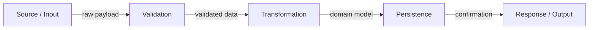
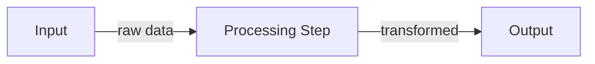
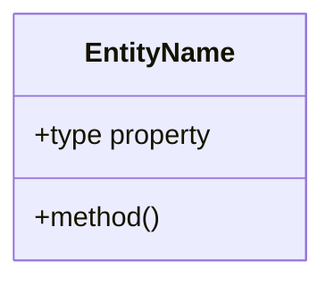

# Spec-Driven Technical Design Skill

## Expertise
- Software architecture patterns
- Mermaid diagram creation (flowchart, sequence, class, ER)
- Data flow analysis and visualization
- Component design and interfaces
- Code anatomy definition
- Change-type-aware design scoping
- Traceability to requirements

## Process
1. **Read Requirements**: Read `specs/changes/<slug>/requirements.md` for source of truth
2. **Read Guidelines**: Use `Glob` and `Read` to examine AGENTS.md, ARCHITECTURE.md, STYLEGUIDE.md, TESTING.md
3. **Discover Existing Patterns**: Use `Grep` to search for existing architectural patterns in the codebase
4. **Classify Change Type**: Determine the nature of the change (see [Change Type Classification](#change-type-classification)) and use it to scope the design
5. Design component structure following existing patterns
6. **Determine Applicable Sections**: Evaluate each optional section against the change type and requirements (see [Section Applicability Guide](#section-applicability-guide)); include only sections that add design value
7. **Impact Analysis**: Evaluate risks and scope of changes when modifying existing features
8. Create Mermaid diagrams (flowchart, sequence, class, ER, and data flow where applicable)
9. Define code anatomy and file placement
10. Map design elements to requirements (DES-X -> REQ-Y.Z)
11. **Validate Design**: Call `mcp:verify_design_file` to ensure diagram validity, traceability, and section structure
12. **Write Before Review**: Save to `specs/changes/<slug>/design.md` before asking the human to review or approve

## Change Type Classification

Before designing, classify the change to scope the design appropriately. The change type determines which sections are relevant and how deep the design should go.

| Change Type | Description | Design Depth |
|-------------|-------------|--------------|
| **New Feature** | Adding entirely new capability | Full design: architecture, data models, data flow, error handling, impact analysis |
| **Enhancement** | Extending or improving existing feature | Focused design: architecture delta, updated data flow if paths change, impact analysis on affected areas |
| **Refactoring** | Restructuring without behavior change | Structural design: before/after architecture, code anatomy changes, risk assessment. Data models and error handling only if the refactor touches them |
| **Bug Fix** | Correcting incorrect behavior | Minimal design: root cause analysis in overview, targeted architecture of the fix, affected code paths. Skip data models and rollback plan unless the fix involves data or schema changes |
| **Performance** | Optimizing speed, memory, or resource usage | Focused design: bottleneck analysis in overview, before/after data flow, benchmarks in testing requirements |
| **Infrastructure** | CI/CD, tooling, deployment, configuration | Operational design: pipeline/deployment architecture, configuration anatomy. Skip data models unless config schema changes |
| **Documentation** | Docs-only changes | Lightweight design: overview with scope of documentation changes, code anatomy of affected doc files. Most technical sections can be skipped |

Use the classified change type throughout the process to decide section inclusion and depth.

### Impact Analysis

When designing changes to existing features or changes that impact multiple parts of the codebase:

**Analyze Impact:**
- Identify all modules, files, and components affected by the change
- Map data flow and dependencies between affected components
- Identify external services or APIs that will be impacted
- Review existing tests to understand coverage gaps

**Document Risks:**
- List potential breaking changes (API changes, data schema changes, etc.)
- Identify performance implications (database load, memory usage, etc.)
- Note security considerations (authentication changes, data access patterns)
- Consider migration needs if data structure changes

**Plan Mitigations:**
- Define backward compatibility requirements
- Document rollback strategies
- Identify testing strategies (unit tests, integration tests, regression tests)
- Plan gradual rollout if deployment risk is high

## Section Applicability Guide

Not every design document needs every section. The designer **MUST evaluate each section** against the change type and requirements, and include it **only when it provides meaningful design value**.

### Always Required (enforced by validator)

These sections MUST always be present regardless of change type:

| Section | Reason |
|---------|--------|
| **Overview** | Every change needs context, goals, and requirement references |
| **System Architecture** | Every change touches code that can be described architecturally, with DES-X elements, Mermaid diagrams, and traceability |
| **Code Anatomy** | Every change produces or modifies files that must be mapped to design elements |
| **Traceability Matrix** | Every design element must be traceable to requirements |

### Conditionally Included (AI-driven decision)

For each of these sections, evaluate the criteria below. **Include the section only when the criteria are met.** When omitting a section, do NOT add a placeholder or empty section — simply leave it out.

| Section | Include When | Skip When |
|---------|-------------|-----------|
| **Data Flow** | The change involves data transformation pipelines, multi-step processing, request/response chains across services, or ETL-like operations | The change is purely structural, UI-only, config-only, or involves a single synchronous call |
| **Data Models** | The change introduces, modifies, or removes data structures (DB tables, API contracts, type definitions, state shapes) | No data structures are created or modified (e.g., refactoring internal logic, documentation changes, UI layout changes) |
| **Error Handling** | The change introduces new failure modes, modifies error boundaries, or affects user-facing error behavior | The change has no new error conditions beyond what existing code already handles (e.g., renaming, documentation, simple refactors) |
| **Impact Analysis** | The change modifies existing features, touches shared code, changes APIs or schemas, or has cross-component effects | The change is a net-new isolated addition with no existing code dependencies (e.g., new standalone utility, new documentation page) |

### Impact Analysis Sub-sections

When Impact Analysis is included, not all sub-sections are always needed:

| Sub-section | Include When | Skip When |
|-------------|-------------|-----------|
| **Breaking Changes** | API signatures, data schemas, or configuration contracts change | Changes are purely additive with no contract modifications |
| **Dependencies** | The change relies on or affects external/internal dependencies | Self-contained change with no dependency interactions |
| **Risk Assessment** | Medium-to-high complexity changes, data migrations, security-sensitive areas | Simple, low-risk changes with clear rollback path |
| **Testing Requirements** | Always include when Impact Analysis is present | — |
| **Rollback Plan** | Production deployments, data migrations, infrastructure changes | Development-only changes, documentation, configuration with instant revert |

## Data Flow Diagram

When data flow is applicable (see Section Applicability Guide), include a **Data Flow** section that visualizes how data moves through the system. This is distinct from System Architecture (which shows component structure) — Data Flow shows the transformation and movement of data across boundaries.

### When to Use Data Flow

- Request/response processing chains (API receives input, transforms, stores, returns)
- Event-driven pipelines (event emitted, consumed, processed, side effects)
- ETL or data transformation sequences
- Multi-service orchestration where data is passed between services
- File processing workflows (read, parse, validate, transform, write)

### Data Flow Diagram Format

Use Mermaid `flowchart` with clear data annotations:



Place the Data Flow section **after System Architecture** and **before Code Anatomy**.

## Output Format

The output **MUST** follow this structure. Include only the sections that are applicable per the Section Applicability Guide:

```markdown
# Design Document

## Overview

<Design goals, constraints, and references to requirements>

### Change Type

<new-feature | enhancement | refactoring | bug-fix | performance | infrastructure | documentation>

### Design Goals

1. Goal one
2. Goal two

### References

- **REQ-1**: <Requirement title>
- **REQ-2**: <Requirement title>

---

## System Architecture

### DES-1: <Component Name>

<Description of the component and its purpose>

```mermaid
<Mermaid diagram>
```

_Implements: REQ-1.1, REQ-1.2_

---

### DES-2: <Component Name>

<Description>

```mermaid
<Mermaid diagram>
```

_Implements: REQ-2.1_

---

## Data Flow

_Include only when the change involves data transformation, multi-step processing, or cross-service data movement._



---

## Code Anatomy

| File Path | Purpose | Implements |
|-----------|---------|------------|
| src/path/file.ts | Description of responsibility | DES-1 |
| src/path/other.ts | Description | DES-2 |

---

## Data Models

_Include only when data structures are introduced, modified, or removed._



---

## Error Handling

_Include only when the change introduces new failure modes or modifies error behavior._

| Error Condition | Response | Recovery |
|-----------------|----------|----------|
| Invalid input | Return 400 | Log and reject |
| Not found | Return 404 | Graceful message |

---

## Impact Analysis

_Include only when modifying existing features, shared code, APIs, or schemas._

| Affected Area | Impact Level | Notes |
|----------------|---------------|-------|
| src/module/affected.ts | High | Core business logic changes |
| src/services/related.ts | Medium | Dependent service updates |

### Breaking Changes

_Include only when API signatures, data schemas, or contracts change._

| Change Type | Description | Mitigation |
|-------------|-------------|-------------|
| API Signature | Method parameter change | Maintain backward compatibility |

### Dependencies

_Include only when the change relies on or affects dependencies._

| Component | Dependency Type | Status |
|-----------|-----------------|--------|
| Service A | Direct | Needs update |

### Risk Assessment

_Include only for medium-to-high complexity or security-sensitive changes._

| Risk | Likelihood | Impact | Mitigation Strategy |
|-------|------------|--------|-------------------|
| Data corruption | Low | High | Add validation, transaction support |

### Testing Requirements

| Test Type | Coverage Goal | Notes |
|-----------|---------------|-------|
| Unit tests | Critical paths | Isolated logic validation |
| Integration tests | Key flows | Cross-component behavior |

### Rollback Plan

_Include only for production deployments, data migrations, or infrastructure changes._

| Scenario | Rollback Steps | Time to Recovery |
|----------|----------------|------------------|
| Deployment failure | Revert to previous commit | < 5 minutes |

---

## Traceability Matrix

| Design Element | Requirements |
|----------------|--------------|
| DES-1 | REQ-1.1, REQ-1.2 |
| DES-2 | REQ-2.1 |
```

## Output Requirements

- Use XML wrapper with `<summary>` and `<document>` tags
- Classify the change type in the Overview section
- Use Mermaid diagrams only (no code samples except data models)
- Number all design elements (DES-1, DES-2, ...)
- Include Data Flow section when data transformation or multi-step processing is involved
- Evaluate each optional section against the Section Applicability Guide — omit sections that do not add value; do NOT include empty placeholder sections
- Include Traceability Matrix linking DES to REQ
- Every design element must reference at least one requirement
- Write `specs/changes/<slug>/design.md` before requesting human approval

## Error Handling (Skill)

- If requirements are ambiguous or incomplete, ask clarifying questions before designing
- If requirements conflict with existing architecture patterns, document the conflict and propose resolution
- If unable to create valid Mermaid diagrams after 3 attempts, escalate to human for clarification
- Document design decisions and trade-offs clearly, especially when multiple approaches exist
- When designing changes to existing features, conduct thorough impact analysis including:
  - Affected components and their dependencies
  - Potential breaking changes and mitigations
  - Risk assessment with likelihood and impact
  - Testing requirements and rollback plans
