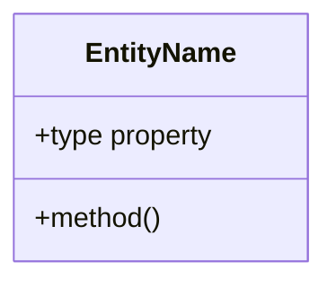

# Spec-Driven Technical Design Skill

## Expertise
- Software architecture patterns
- Mermaid diagram creation
- Component design and interfaces
- Code anatomy definition
- Traceability to requirements

## Process
1. **Read Requirements**: Read `specs/changes/<slug>/requirements.md` for source of truth
2. **Read Guidelines**: Use `Glob` and `Read` to examine AGENTS.md, ARCHITECTURE.md, STYLEGUIDE.md
3. **Discover Existing Patterns**: Use `Grep` to search for existing architectural patterns in the codebase
4. Design component structure following existing patterns
5. **Impact Analysis**: Evaluate risks and scope of changes when modifying existing features
6. Create Mermaid diagrams (class, sequence, ER)
7. Define code anatomy and file placement
8. Map design elements to requirements (DES-X -> REQ-Y.Z)
9. **Validate Design**: Call `mcp:verify_design_file` to ensure diagram validity, traceability, and section structure

### Impact Analysis

When designing changes to existing features or changes that impact multiple parts of the codebase:

**Analyze Impact:**
- Identify all modules, files, and components affected by the change
- Map data flow and dependencies between affected components
- Identify external services or APIs that will be impacted
- Review existing tests to understand coverage gaps

**Document Risks:**
- List potential breaking changes (API changes, data schema changes, etc.)
- Identify performance implications (database load, memory usage, etc.)
- Note security considerations (authentication changes, data access patterns)
- Consider migration needs if data structure changes

**Plan Mitigations:**
- Define backward compatibility requirements
- Document rollback strategies
- Identify testing strategies (unit tests, integration tests, regression tests)
- Plan gradual rollout if deployment risk is high

## Output Format

The output **MUST** follow this exact structure:

```markdown
# Design Document

## Overview

<Design goals, constraints, and references to requirements>

### Design Goals

1. Goal one
2. Goal two

### References

- **REQ-1**: <Requirement title>
- **REQ-2**: <Requirement title>

---

## System Architecture

### DES-1: <Component Name>

<Description of the component and its purpose>

```mermaid
<Mermaid diagram>
```

_Implements: REQ-1.1, REQ-1.2_

---

### DES-2: <Component Name>

<Description>

```mermaid
<Mermaid diagram>
```

_Implements: REQ-2.1_

---

## Code Anatomy

| File Path | Purpose | Implements |
|-----------|---------|------------|
| src/path/file.ts | Description of responsibility | DES-1 |
| src/path/other.ts | Description | DES-2 |

---

## Data Models



---

## Error Handling

| Error Condition | Response | Recovery |
|-----------------|----------|----------|
| Invalid input | Return 400 | Log and reject |
| Not found | Return 404 | Graceful message |

---

## Impact Analysis

_Required for all changes to existing features or multi-component changes_

| Affected Area | Impact Level | Notes |
|----------------|---------------|-------|
| src/module/affected.ts | High | Core business logic changes |
| src/services/related.ts | Medium | Dependent service updates |
| /api/endpoint | Low | Documentation update needed |

### Breaking Changes

| Change Type | Description | Mitigation |
|-------------|-------------|-------------|
| API Signature | Method parameter change | Maintain backward compatibility |
| Data Schema | Database table alteration | Migration script required |
| Configuration | Environment variable change | Update deployment docs |

### Dependencies

| Component | Dependency Type | Status |
|-----------|-----------------|--------|
| Service A | Direct | Needs update |
| Library B | Indirect | Version compatible |
| External API | Contract | Validated |

### Risk Assessment

| Risk | Likelihood | Impact | Mitigation Strategy |
|-------|------------|--------|-------------------|
| Data corruption | Low | High | Add validation, transaction support |
| Performance regression | Medium | Medium | Load testing before deployment |
| Integration failure | Low | High | Add circuit breaker, retry logic |

### Testing Requirements

| Test Type | Coverage Goal | Notes |
|-----------|---------------|-------|
| Unit tests | 80% | Critical paths only |
| Integration tests | Key flows | Service-to-service calls |
| Regression tests | Existing features | All affected components |

### Rollback Plan

| Scenario | Rollback Steps | Time to Recovery |
|----------|----------------|------------------|
| Deployment failure | Revert to previous commit | < 5 minutes |
| Data migration failure | Run undo migration script | < 15 minutes |
| API incompatibility | Enable feature flag off | Immediate |

---

## Traceability Matrix

| Design Element | Requirements |
|----------------|--------------|
| DES-1 | REQ-1.1, REQ-1.2 |
| DES-2 | REQ-2.1 |
```

## Output Requirements

- Use XML wrapper with `<summary>` and `<document>` tags
- Use Mermaid diagrams only (no code samples except data models)
- Number all design elements (DES-1, DES-2, ...)
- Include Code Anatomy section with file paths
- Include Impact Analysis section for changes to existing features (required when modifying existing code)
- Include Traceability Matrix linking DES to REQ
- Every design element must reference at least one requirement

## Error Handling

- If requirements are ambiguous or incomplete, ask clarifying questions before designing
- If requirements conflict with existing architecture patterns, document the conflict and propose resolution
- If unable to create valid Mermaid diagrams after 3 attempts, escalate to human for clarification
- Document design decisions and trade-offs clearly, especially when multiple approaches exist
- When designing changes to existing features, conduct thorough impact analysis including:
  - Affected components and their dependencies
  - Potential breaking changes and mitigations
  - Risk assessment with likelihood and impact
  - Testing requirements and rollback plans
