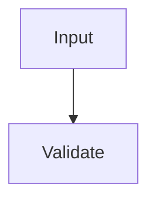

# Design Document

## Overview

Simple architecture for fixture.

## System Architecture

### DES-1: Validator

_Implements: REQ-1.1_

## Code Anatomy

| File Path | Purpose | Implements |
|-----------|---------|------------|
| src/index.ts | Validation | DES-1 |
