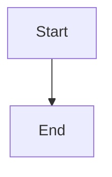

# Design Document

## Overview

This design intentionally has bad references.

## System Architecture

### DES-1: Faulty link

_Implements: REQ-99.1_

## Code Anatomy

| File Path | Purpose | Implements |
|-----------|---------|------------|
| src/index.ts | Faulty traceability | DES-1 |
