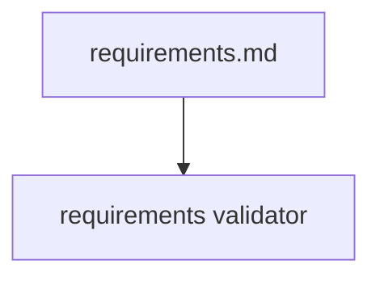
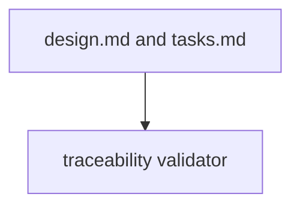

# Design Document

## Overview

The design uses dedicated validators per document type.

## System Architecture

### DES-1: Requirements validator

_Implements: REQ-1.1, REQ-1.2_

### DES-2: Traceability validator

_Implements: REQ-2.1_

## Code Anatomy

| File Path | Purpose | Implements |
|-----------|---------|------------|
| src/index.ts | Tool handlers and validators | DES-1, DES-2 |

## Traceability Matrix

| Design Element | Requirements |
|----------------|--------------|
| DES-1 | REQ-1.1, REQ-1.2 |
| DES-2 | REQ-2.1 |
