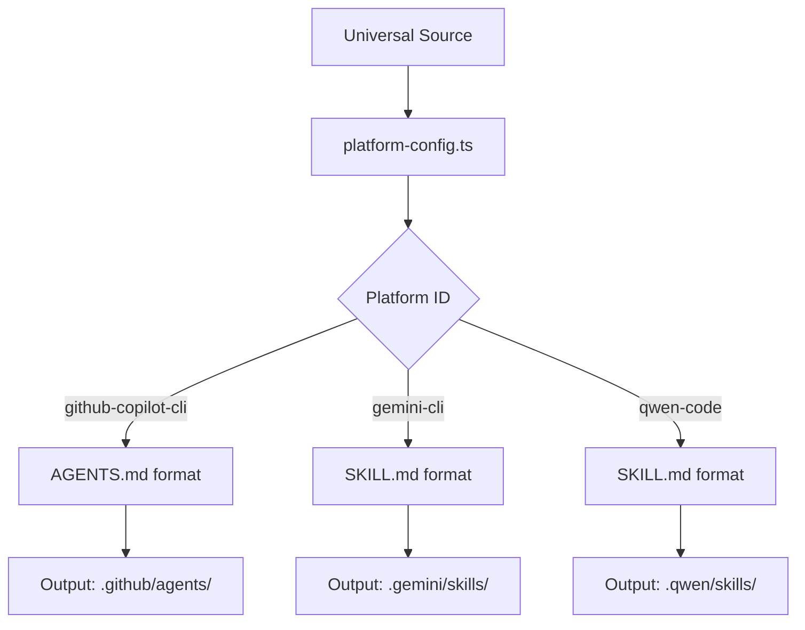
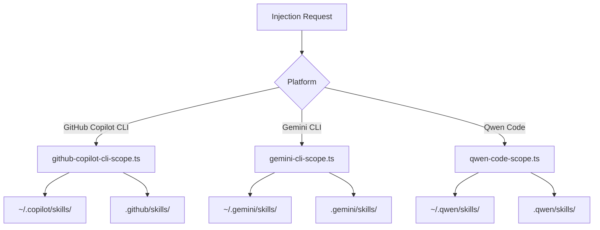
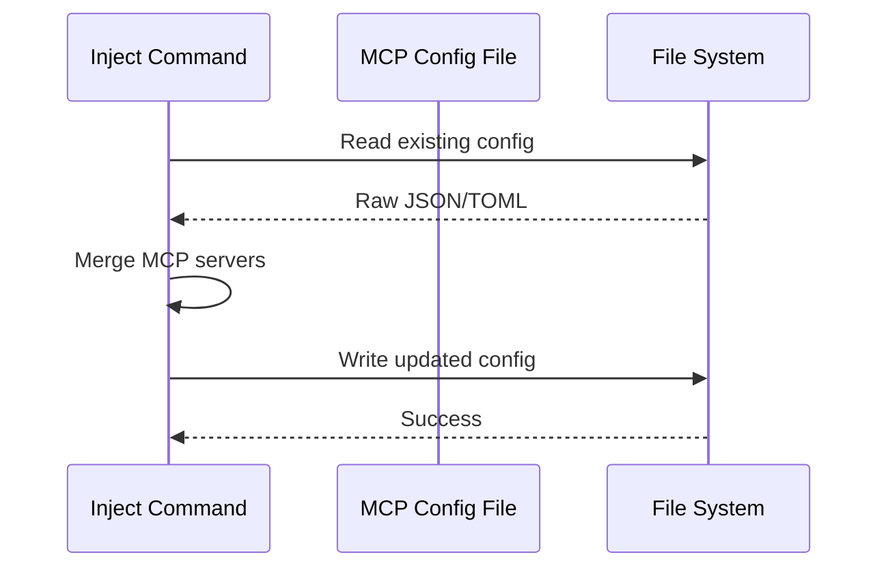
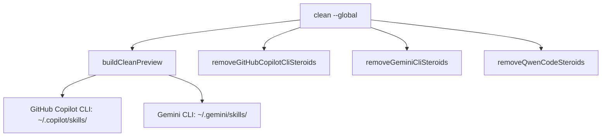
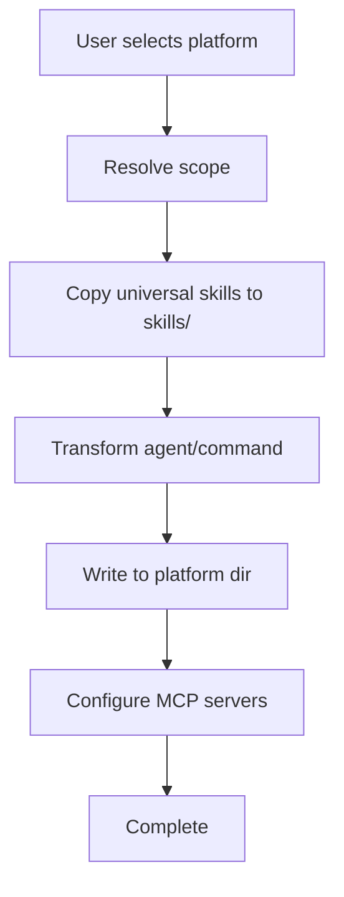

# Design Document

## Overview

This design extends the Spec-Driven Steroids CLI to support three new CLI-based AI coding assistant platforms: GitHub Copilot CLI, Gemini CLI, and Qwen Code CLI. The implementation follows the existing platform injection pattern, adding scope resolution modules, platform configurations, MCP configuration functions, and clean command support.

### Change Type

`new-feature`

### Design Goals

1. Maintain consistency with existing platform injection patterns
2. Minimize code duplication by following established scope/MCP configuration patterns
3. Support user-level and project-level injection for all three platforms

### References

- **REQ-1**: GitHub Copilot CLI Support
- **REQ-2**: Gemini CLI Support
- **REQ-3**: Qwen Code CLI Support
- **REQ-4**: UX Consistency Across Platforms
- **REQ-5**: Platform Configuration Parity
- **REQ-6**: Skill Directory Compatibility

---

## System Architecture

### DES-1: Platform Configurations

Platform configurations define how universal templates are transformed for each platform, including format type, frontmatter fields, and output directory structure.

**Responsibility:** Define platform-specific transformation rules for agents and commands.

**Files Modified:**
- `packages/cli/src/cli/platform-config.ts`

_Implements: REQ-1.5, REQ-2.5, REQ-3.5, REQ-5.1, REQ-5.2_

---

### DES-2: Scope Resolution

Scope resolution modules provide path utilities for each platform's user-level and project-level configurations.

**Responsibility:** Provide path resolution for skills directories and MCP configuration files.

**Files Created:**
- `packages/cli/src/cli/github-copilot-cli-scope.ts`
- `packages/cli/src/cli/gemini-cli-scope.ts`
- `packages/cli/src/cli/qwen-code-scope.ts`

_Implements: REQ-1.1, REQ-1.2, REQ-2.1, REQ-2.2, REQ-3.1, REQ-3.2_

---

### DES-3: MCP Configuration

MCP configuration functions handle reading, updating, and writing MCP server settings for each platform.

**Responsibility:** Preserve existing platform MCP config files while avoiding SDS-owned external MCP server entries.

**Files Modified:**
- `packages/cli/src/cli/index.ts` (add `configureGitHubCopilotCliMcp`, `configureGeminiCliMcp`, `configureQwenCodeMcp`)

_Implements: REQ-1.3, REQ-1.4, REQ-2.3, REQ-2.4, REQ-3.3, REQ-3.4_

---

### DES-4: Clean Command Integration

Clean command integration adds removal functions and preview entries for the new platforms.

**Responsibility:** Remove globally injected Spec-Driven artifacts from platforms that support user-level injection.

**Files Modified:**
- `packages/cli/src/cli/index.ts` (add removal functions and update clean preview)

_Implements: REQ-4.5_

---

## Code Anatomy

| File Path | Purpose | Implements |
|-----------|---------|------------|
| `src/cli/platform-config.ts` | Platform configuration entries | DES-1 |
| `src/cli/github-copilot-cli-scope.ts` | Scope paths for GitHub Copilot CLI | DES-2 |
| `src/cli/gemini-cli-scope.ts` | Scope paths for Gemini CLI | DES-2 |
| `src/cli/qwen-code-scope.ts` | Scope paths for Qwen Code | DES-2 |
| `src/cli/index.ts` | MCP config + injection + clean logic | DES-3, DES-4 |

---

## Data Flow

### Injection Flow

### Skills Copy vs Transform

| Artifact Type | Processing | Output |
|--------------|------------|--------|
| Skills directories | Direct copy | `skills/<skill-name>/` |
| Agent file | Transform + write | `agents/spec-driven.agent.md` |
| Command file | Transform + write | `commands/spec-driven.md` |

---

## Traceability Matrix

| Design Element | Requirements |
|---------------|--------------|
| DES-1 | REQ-1.5, REQ-2.5, REQ-3.5, REQ-5.1, REQ-5.2 |
| DES-2 | REQ-1.1, REQ-1.2, REQ-2.1, REQ-2.2, REQ-3.1, REQ-3.2 |
| DES-3 | REQ-1.3, REQ-1.4, REQ-2.3, REQ-2.4, REQ-3.3, REQ-3.4 |
| DES-4 | REQ-4.5 |

---

## Platform Configuration Details

### GitHub Copilot CLI (`github-copilot-cli`)

| Property | Value |
|----------|-------|
| Format | Markdown |
| Skills Directory (user) | `~/.copilot/skills/` |
| Skills Directory (project) | `.github/skills/` |
| Agent File | `spec-driven.agent.md` |
| Agent Directory | `agents` |
| MCP Config (user) | `~/.config/github-copilot/mcp.json` |
| MCP Config (project) | `.github/mcp.json` |

### Gemini CLI (`gemini-cli`)

| Property | Value |
|----------|-------|
| Format | Markdown (SKILL.md) |
| Skills Directory (user) | `~/.gemini/skills/` |
| Skills Directory (project) | `.gemini/skills/` |
| Agent File | `spec-driven.md` |
| Agent Directory | `skills` |
| MCP Config (user/project) | `~/.gemini/mcp_config.json` or `.gemini/mcp_config.json` |

### Qwen Code CLI (`qwen-code`)

| Property | Value |
|----------|-------|
| Format | Markdown (SKILL.md) |
| Skills Directory (user) | `~/.qwen/skills/` |
| Skills Directory (project) | `.qwen/skills/` |
| Agent File | `spec-driven.md` |
| Agent Directory | `skills` |
| MCP Config (user/project) | `~/.qwen/mcp_config.json` or `.qwen/mcp_config.json` |
